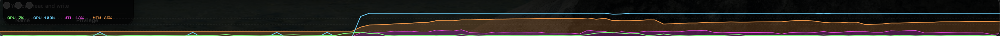

# SysGraph

A compact floating ticker tape for macOS that graphs CPU, GPU, and memory usage over time. Sits just above the Dock, always on top, no Dock icon.



## Building and running

```
swift SysGraph.swift
```

Or compile to a binary:

```
swiftc SysGraph.swift -o SysGraph && ./SysGraph
```

Requires macOS 13+. The window is resizable and its position is saved between launches.

## What the four numbers mean

**CPU** (green) — percentage of total CPU capacity in use across all cores, sampled as a delta between ticks so it reflects the current second rather than a cumulative average. Includes user, system, and nice time; excludes idle.

**GPU** (cyan) — GPU engine utilization as a percentage, read from the IOAccelerator driver via IOKit. On Apple Silicon this reflects the unified GPU; on Intel Macs it reads the discrete or integrated GPU. This measures *compute activity*, not memory.

**MTL** (magenta) — bytes of unified memory currently held by the GPU for Metal, expressed as a percentage of total RAM. On Apple Silicon, Metal allocations come from the same pool as system RAM, so this shows how much of that shared pool the GPU has claimed. The magenta band on the graph rises from zero and forms the floor of the memory region.

**MEM** (orange) — total system memory pressure as a percentage of RAM: active + wired + compressed pages via `vm_statistics64`. Because Apple Silicon uses unified memory, this number already includes whatever MTL is reporting — they are not additive. The orange band sits on top of the MTL band; together they fill up to the true total memory in use. The top edge of the MEM line is the number to watch for overall memory pressure.

## Reading the graph

The memory region is drawn as two stacked fills rather than independent lines, because on Apple Silicon GPU memory and system memory share the same physical pool:

```
100% ┤
     │  ░░░░ MEM (everything above MTL: kernel, CPU processes)
     │▓▓▓▓▓▓ MTL (GPU-resident Metal allocations)
  0% ┤
```

When a Metal-heavy workload (a large ML model, a GPU renderer) grows its allocation, the magenta floor rises and pushes the orange band up with it — which is exactly what is happening physically.

CPU% and GPU% are utilization lines drawn over the memory fills. A useful pattern to watch for: MTL high but GPU% low means a model is loaded into GPU memory but sitting idle (not currently inferring or rendering).
